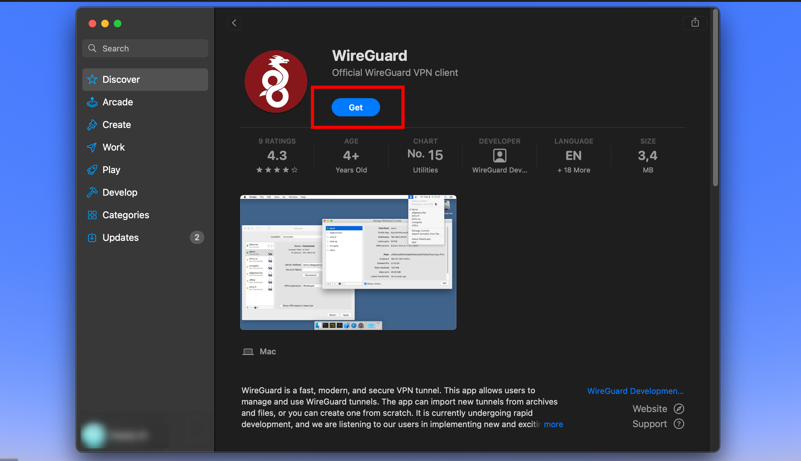

# WireGuard Setup Guide 

## 1. Install WireGuard
Download and install [WireGuard](https://www.wireguard.com/install/) for your platform (Windows, macOS, Linux, Android, iOS).

## For Mac 

## 2. Obtain Configuration
Get the configuration file (`.conf`) or QR code from the administrator.  
This file contains all required connection parameters (keys, IP, endpoint).

---

## 3. Import Configuration
Open WireGuard and:
- Select **“Add Tunnel” → “Import from file”** (desktop), or  
- Scan the QR code (mobile)

---

## 4. Activate Connection
Enable the tunnel using the toggle or **“Activate”** button.  
A successful connection will show traffic or handshake status.

---

## 5. Verify Connection
- Open a browser and check internet access  
- Optionally verify IP address change (e.g., via any “what is my IP” service)

---

## Notes
- Keep configuration files secure (they contain private keys)  
- Do not share credentials with others  
- Contact the administrator if the connection fails  